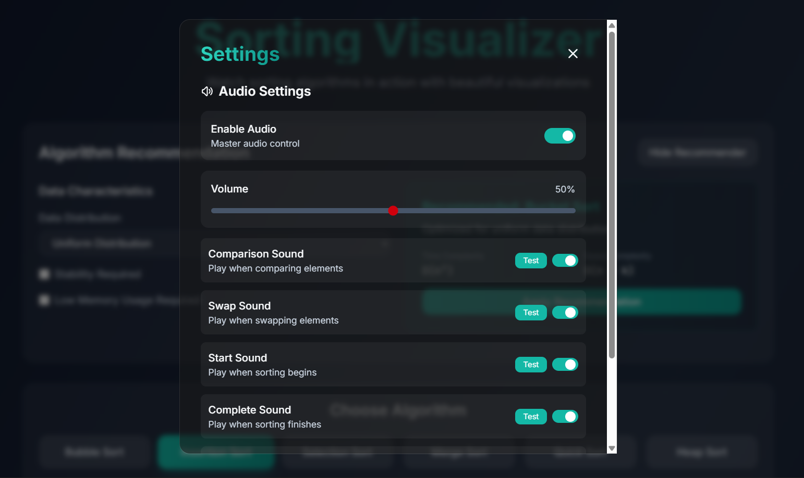

# React.js Sorting Algorithm Visualizer

 ()

This project is a React.js (Vite) web application that allows users to visualize various sorting algorithms such as Bubble Sort, Insertion Sort, and more in real-time. It's a fun and educational way to learn about sorting algorithms. The user is able to adjust the speed of the sorting process, read about how each algorithm works, and get intelligent algorithm recommendations based on their specific needs.

<a href="https://sort-sonic-ai-sorting-visualize.vercel.app">View Website</a>

## Features

-  [x]  **Various Algorithms**: Bubble Sort, Insertion Sort, Selection Sort, Merge Sort, Quick Sort, Heap Sort, Radix Sort, and Bucket Sort

-  [x]  **Visualization**: You can see the sorting process visualized in real-time by 3D rendered bars. If it's going too fast, feel free to change the speed!

-  [x]  **Explanation**: Upon seeing the visualization, you also get a useful explanation how the algorithm works

-  [x]  **Comparison**: Besides the explanation, the user is able to compare the time and space complexity of the various algorithms

-  [x]  **Algorithm Recommendation**: Get intelligent recommendations for the best sorting algorithm based on your specific data characteristics:
   - Array size
   - Data distribution (random, nearly sorted, reversed, etc.)
   - Stability requirements
   - Memory constraints

-  [x]  **Audio Feedback**: Experience sorting with sound:
   - Comparison sounds when elements are compared
   - Swap sounds when elements are swapped
   - Start sound when sorting begins
   - Completion melody when sorting finishes
   - New array sound when generating a new array
   - Adjustable volume and individual sound toggles


## Getting Started

### Prerequisites

- Node.js (version 12 or higher)
  

### Installation

1. Clone the repository to your local machine:

```bash

git clone https://github.com/0xBitBuster/reactjs-sorting-visualizer

```

2. Install the dependencies:
```bash

npm install

```
  

### Usage

To start the server, run:

```bash
npm run dev
```

By default, the web application runs on `http://localhost:5173`

### Using the Algorithm Recommender

1. Click the "Show Recommender" button at the top of the application
2. Configure your data characteristics:
   - Select the data distribution type (random, nearly sorted, etc.)
   - Check "Stability Required" if you need to maintain the relative order of equal elements
   - Check "Low Memory Usage Required" if memory efficiency is important
3. View the recommendation with explanation and complexity information
4. Click "Apply Recommendation" to automatically select the recommended algorithm

### Using the Audio Feature

1. Click the settings icon (gear) in the top-right corner
2. In the settings panel, find the "Audio Settings" section
3. Toggle "Enable Audio" to turn all sounds on/off
4. Adjust the volume slider to your preferred level
5. Toggle individual sounds on/off:
   - Comparison Sound - plays when comparing elements
   - Swap Sound - plays when swapping elements
   - Start Sound - plays when sorting begins
   - Complete Sound - plays when sorting finishes
   - New Array Sound - plays when generating a new array
6. Click "Test" next to any sound to preview it

  

## Technical Implementation

### Algorithm Recommendation System

The recommendation system uses a rule-based scoring approach to suggest the most appropriate sorting algorithm based on:

- **Array Size**: Different algorithms perform better on different sized arrays
- **Data Distribution**: Some algorithms are optimized for nearly sorted data
- **Stability Requirements**: Whether the original order of equal elements must be preserved
- **Memory Constraints**: Whether memory usage should be minimized

The core recommendation logic is implemented in `src/helpers/algorithmRecommender.js` and integrated with the application's state management in `src/context/SortingContext.jsx`.

## Contributing

Contributions are welcome! If you have a feature request or bug report, please open an issue. If you want to contribute code, please fork the repository and submit a pull request.

## License

This project is licensed under the MIT License - see the LICENSE file for details.
